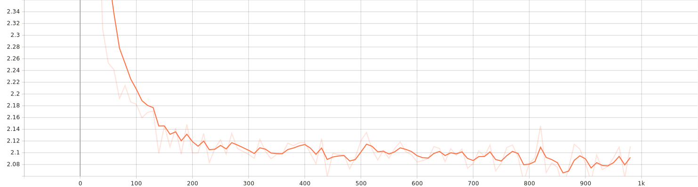
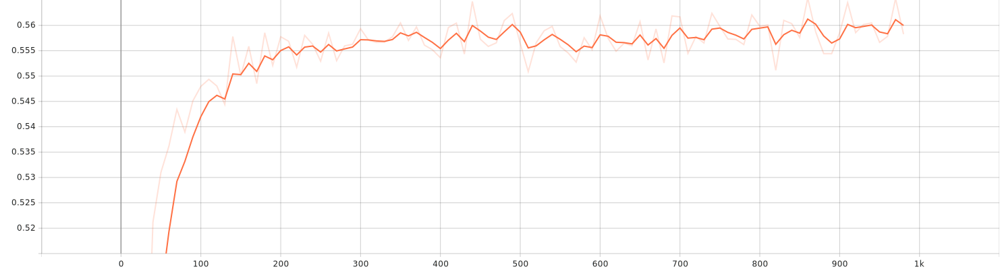

# LLM Instruction‑Tuning for Text Classification (LoRA + QLoRA)

> **Train a decoder‑only LLM to follow *classification* instructions using LoRA adapters and 4‑bit quantization.**  
> Minimal, modular, and fast: one config, two scripts (`train.py`, `predict.py`).

---

## 🚀 TL;DR

This repo instruction‑tunes a decoder‑only LLM (default: **`meta-llama/Llama-3.2-1B`**) to classify short texts (e.g., arXiv titles/abstracts) **by responding with an exact label string**. It uses:

- **PEFT/LoRA** adapters (tiny trainable layers) instead of full fine‑tuning
- **4‑bit (QLoRA‑style)** quantization for memory‑efficient training/inference
- **TRL’s `SFTTrainer`** for supervised instruction tuning
- Simple **prompt templates** that turn classification into a generative task

Out of the box, it ships with an **arXiv‑style demo** (5 labels) and example results (~94% accuracy).
---
## 🚀 Model on Hugging Face

[](https://huggingface.co/Amirhossein75/Text-Classification-Instrunction-Tuning-Llama)

<p align="center">
  <a href="https://huggingface.co/Amirhossein75/Text-Classification-Instrunction-Tuning-Llama">
    
  </a>
</p>

---


## ✨ What’s inside

```
LLM-Instruction-Tuning-Text-Classification/
├── scripts/
│   ├── train.py           # one‑command training with TRL + LoRA
│   └── predict.py         # attach LoRA adapters & run inference/eval
├── src/
│   ├── config.py          # dataclass: all tunables live here (TrainConfig)
│   ├── data.py            # CSV I/O, prompt builders, seeding, HF dataset adapter
│   ├── model.py           # 4‑bit (bitsandbytes) + tokenizer + LoRA configs
│   ├── training.py        # wrapper that builds TRL SFTTrainer
│   ├── infer.py           # generation pipeline & label decoding
│   ├── metrics.py         # accuracy/F1, classification report, confusion matrix
│   ├── prepare_all_arxiver_data.py
│   └── prepare_top_5_arxiver_data.py
├── requirements.txt
├── .gitignore
└── results.txt            # sample evaluation output
```

---

## 🧠 Why instruction‑tune a classifier?

Instead of training a bespoke encoder classifier, we **teach a general‑purpose LLM to follow a classification instruction**. This brings three benefits:

1. **Flexibility:** add/remove labels or extend the schema without changing the head.
2. **Transfer:** one prompting style scales across domains/tasks.
3. **Traceability:** prompts & responses are plain text—easy to debug and audit.

---

## 🧩 Prompt format

The project formulates classification as short **instruction → answer** exchanges.

**Training prompts** (supervised):  

```text
Classify the text into {labels_str} and return the answer as the exact text label.
text: {text}
label: {gold_label}
```

**Inference prompts** (generation):  

```text
Classify the text into {labels_str} and return the answer as the exact text label.
text: {text}
label:
```

> The model is evaluated by string‑matching its generated label to the ground truth.

---

## 📦 Data format

By default, the repo expects three CSVs inside a folder (see `TrainConfig.base_path`):

- `train.csv`
- `validation.csv`
- `test.csv`

Each CSV should include:
- **`label_name`** (or customize via `--label_column`)
- One or more text fields, default: **`title`**, **`abstract`** (customize via `--text_fields`)

**Minimal example (`train.csv`):**

```csv
title,abstract,label_name
"Neural topic models with...", "We propose...", "cs.CL"
"Vision transformer for...", "We revisit...", "cs.CV"
```

If a text column is missing or blank, it’s skipped automatically. Text fields are concatenated into a single sentence with proper punctuation.

> Utilities such as `src/prepare_top_5_arxiver_data.py` can help produce demo CSVs. Feel free to adapt them to your own corpus.

---

## ⚙️ Configuration (everything in one place)

All defaults live in `src/config.py` (`TrainConfig`). Highlights:

- **Base model:** `meta-llama/Llama-3.2-1B`
- **Labels (demo):** `['cs.CL', 'cs.CV', 'cs.LG', 'hep-ph', 'quant-ph']`
- **LoRA:** `r=2`, `alpha=2`, `dropout=0.0` (easy to scale up)
- **Quantization:** 4‑bit NF4 + bfloat16 compute (QLoRA‑style)
- **Sequence length:** 512
- **Trainer:** epochs, batch sizes, eval/save/logging strategies, seed
- **Generation:** deterministic by default (`temperature=0.0`, few tokens)

You can override any config at the CLI (see below).

---

## 🛠️ Setup

> Python ≥ 3.10 recommended.

```bash
# 1) Create & activate a virtual env
python -m venv .venv
# Linux/macOS
source .venv/bin/activate
# Windows (PowerShell)
# .venv\Scripts\Activate.ps1

# 2) Install deps
pip install --upgrade pip
pip install -r requirements.txt

# 3) (If your base HF model requires access) set a token:
# Linux/macOS
export HF_TOKEN=YOUR_HF_ACCESS_TOKEN
# Windows (PowerShell)
# $env:HF_TOKEN="YOUR_HF_ACCESS_TOKEN"
```

> **GPU note:** The project expects an NVIDIA CUDA GPU for 4‑bit (bitsandbytes) training and inference. CPU‑only runs are not supported by the provided scripts.

---

---

## ⚡ Use `uv` for dependency management (recommended)

[`uv`](https://docs.astral.sh/uv/) is a fast, modern Python package & project manager from Astral (creators of Ruff). It is a drop‑in replacement for most `pip` workflows, with first‑class virtualenvs, lockfiles, and reproducible installs.

> This repository currently ships a standard **`requirements.txt`** (see project root). You can continue using `pip`, **or** follow these `uv` steps for a faster and more reproducible setup.

### 1) Install `uv`

**macOS / Linux**

```bash
curl -LsSf https://astral.sh/uv/install.sh | sh
```

**Windows (PowerShell)**

```powershell
powershell -ExecutionPolicy ByPass -c "irm https://astral.sh/uv/install.ps1 | iex"
```

> Alternatives: `brew install uv` (macOS), `winget install --id=astral-sh.uv -e` (Windows), or `pipx install uv`.

### 2) Create the virtual environment

`uv` defaults to a project‑local `.venv` and will automatically discover and use it.

```bash
uv venv                 # creates .venv (optionally: uv venv --python 3.11)
# optional activation (uv will find .venv even if you skip this)
source .venv/bin/activate        # macOS/Linux
# or on Windows PowerShell
# .\.venv\Scripts\Activate.ps1
```

### 3) Install dependencies from `requirements.txt`

Two equivalent ways, depending on how strict you want to be:

- **Exact, reproducible environment** (removes anything not listed):  
  ```bash
  uv pip sync requirements.txt
  ```
- **Flexible install** (keeps extra packages if already present):  
  ```bash
  uv pip install -r requirements.txt
  ```

> If you later add a package and want it pinned into `requirements.txt`, see **Step 4**.

### 4) (Optional) Lock or upgrade dependencies

If you maintain a `requirements.in` or a `pyproject.toml`, use `uv` to **compile** a fully pinned `requirements.txt`:

```bash
# from a pyproject.toml
uv pip compile pyproject.toml -o requirements.txt

# from a requirements.in
uv pip compile requirements.in -o requirements.txt

# upgrade a single package during compile
uv pip compile - -o requirements.txt --upgrade-package ruff <<< "ruff"
```

Re‑apply the lock to your environment at any time with:
```bash
uv pip sync requirements.txt
```

### 5) (Optional) Migrate to `pyproject.toml` + `uv.lock`

For first‑class, cross‑platform locking you can move to a `uv` project with a `pyproject.toml` + `uv.lock`:

```bash
# initialize a minimal project in the current directory
uv init --bare

# import everything from your existing requirements.txt
uv add -r requirements.txt

# (uv will resolve + write uv.lock and sync .venv automatically)
# manually refresh the lockfile later if needed
uv lock

# install/update the environment from the lockfile
uv sync
```

Commit **`pyproject.toml`** and **`uv.lock`** to version control.  
If you still need a `requirements.txt` for external tooling, export it from the lockfile:

```bash
# export exact, pinned requirements
uv export --format requirements-txt --no-hashes > requirements.txt
```

### 6) CI example (GitHub Actions)

```yaml
# .github/workflows/ci.yml
name: ci
on: [push, pull_request]
jobs:
  test:
    runs-on: ubuntu-latest
    steps:
      - uses: actions/checkout@v4
      - name: Install uv
        run: curl -LsSf https://astral.sh/uv/install.sh | sh
      - name: Set up venv + install deps
        run: |
          uv venv --python 3.11
          uv pip sync requirements.txt
      - name: Run tests / scripts
        run: |
          source .venv/bin/activate
          # python -m pytest
          # or: python scripts/train.py ...
```

> **Tip:** `uv` can download a specific Python if missing (e.g., `uv venv --python 3.11`). It will still work fine with a system Python if one is available.

---
## 🏃‍♀️ Quickstart: Train

The simplest run trains LoRA adapters on your CSVs and saves them to an output folder:

```bash
python scripts/train.py   --base_path dataset   --train_file train.csv   --val_file validation.csv   --test_file test.csv   --label_column label_name   --text_fields title abstract   --base_model_name meta-llama/Llama-3.2-1B   --output_dir llama-3.2-1b-arxiver-lora
```

What happens under the hood:

- Loads CSVs → builds *instruction* prompts for train/val/test
- Loads the base model in **4‑bit** with **bitsandbytes**
- Wraps the model with **LoRA** adapters (PEFT)
- Runs **TRL’s `SFTTrainer`** for one or more epochs
- Saves the LoRA weights + tokenizer to `--output_dir`

---


### 📉 Loss Curve

The following plot shows the training loss progression:



The following plot shows the training mean token accuracy progression:



*(SVG file generated during training(by tensorboard logs) and stored under `assets/`)*

## 🖥️ Training Hardware & Environment

- **Device:** Laptop (Windows, WDDM driver model)  
- **GPU:** NVIDIA GeForce **RTX 3080 Ti Laptop GPU** (16 GB VRAM)  
- **Driver:** **576.52**  
- **CUDA (driver):** **12.9**  
- **PyTorch:** **2.8.0+cu129**  
- **CUDA available:** ✅ 


## 📊 Training Logs & Metrics

- **Total FLOPs (training):** `36,876,683,692,736,510`  
- **Training runtime:** `6,313.6069` seconds  
- **Logging:** TensorBoard-compatible logs in `scripts/llama-3.2-1b-arxiver-lora/logs`  

You can monitor training live with:

```bash
tensorboard --logdir scripts/llama-3.2-1b-arxiver-lora/logs
```

## 🔮 Inference & evaluation

Attach the saved LoRA adapters to the base model and predict:

```bash
python scripts/predict.py   --base_path dataset   --test_file test.csv   --base_model_name meta-llama/Llama-3.2-1B   --output_dir llama-3.2-1b-arxiver-lora   --save_csv predictions.csv
```

This script:

- Recreates the **inference prompt** for each test row
- Generates the label deterministically (`temperature=0.0` by default)
- Computes **accuracy**, **micro/macro F1**, a **classification report**, and a **confusion matrix**
- Optionally writes `predictions.csv` (prompt, gold, pred)

---
## 📊 Overall Performance

- **Accuracy:** `93.8%`
- **F1 Score (Micro):** `0.938`
- **F1 Score (Macro):** `0.950`

These metrics highlight the robustness of the model, achieving both high precision and recall across diverse classes.

---

## 🔍 Detailed Per-Class Report

| Class     | Precision | Recall | F1-Score | Support |
|-----------|-----------|--------|----------|---------|
| **cs.CL** (Computation & Language) | 0.914 | 0.963 | 0.938 | 432 |
| **cs.CV** (Computer Vision)        | 0.935 | 0.923 | 0.929 | 545 |
| **cs.LG** (Machine Learning)       | 0.917 | 0.890 | 0.903 | 536 |
| **hep-ph** (High Energy Physics)   | 0.994 | 0.988 | 0.991 | 164 |
| **quant-ph** (Quantum Physics)     | 0.986 | 0.990 | 0.988 | 293 |

**Macro Average:** Precision = 0.949 | Recall = 0.951 | F1 = 0.950  
**Weighted Average:** Precision = 0.938 | Recall = 0.938 | F1 = 0.938  

---

## 🧾 Confusion Matrix

The confusion matrix (rows = true, cols = predicted) reveals strong diagonal dominance, confirming reliable predictions per class.

```
[[416   6  10   0   0]
 [ 12 503  30   0   0]
 [ 27  29 477   0   3]
 [  0   0   1 162   1]
 [  0   0   2   1 290]]
```

- **cs.CL:** 416 correctly classified, few misclassified as cs.CV/cs.LG  
- **cs.CV:** 503 correctly classified, minor confusion with cs.CL & cs.LG  
- **cs.LG:** 477 correctly classified, some overlap with cs.CV  
- **hep-ph:** Almost perfect with only 2 misclassifications  
- **quant-ph:** Near perfect classification with only 3 misclassifications  

---


## TL;DR – Key Hyperparameters

| Category | Setting | Value |
|---|---|---|
| **Model** | base_model_name | `meta-llama/Llama-3.2-1B` |
|  | output_dir | `llama-3.2-1b-arxiver-lora` |
|  | max_seq_length | `512` *(not passed to SFTTrainer in training.py; see notes)* |
| **Data** | dataset_name | `arxiver` |
|  | base_path | `dataset` |
|  | train/val/test files | `train.csv`, `validation.csv`, `test.csv` |
|  | label_column | `label_name` |
|  | text_fields | ['title', 'abstract'] |
|  | labels | ['cs.CL', 'cs.CV', 'cs.LG', 'hep-ph', 'quant-ph'] |
| **Training** | num_train_epochs | 1 |
|  | per_device_train_batch_size | 8 |
|  | per_device_eval_batch_size | 8 |
|  | gradient_accumulation_steps | 2 |
|  | learning_rate | 0.0002 |
|  | weight_decay | 0.001 |
|  | warmup_ratio | 0.03 |
|  | logging_steps | 10 |
|  | evaluation_strategy | `epoch` |
|  | save_strategy | `epoch` |
|  | save_total_limit | 2 |
|  | report_to | `tensorboard` |
|  | seed | 762920 |
| **LoRA** | r | 2 |
|  | alpha | 2 |
|  | dropout | 0.0 |
| **Quantization (QLoRA)** | load_in_4bit | True |
|  | bnb_4bit_compute_dtype | `bfloat16` |
|  | bnb_4bit_quant_type | `nf4` |
|  | bnb_4bit_use_double_quant | True |
| **Inference** | gen_max_new_tokens | 8 |
|  | gen_do_sample | False |
|  | gen_temperature | 0.0 |
| **TrainingArguments (from `training.py`)** | fp16 | True |
|  | bf16 | False |
|  | tf32 | True |
|  | load_best_model_at_end | True |
|  | metric_for_best_model | `eval_loss` |
|  | greater_is_better | False |
|  | logging_dir | `llama-3.2-1b-arxiver-lora/logs` |
| **SFTTrainer tweak** | gradient_checkpointing_enable | True (use_reentrant=False) |

---

## Canonical Hyperparameters (JSON)
The following JSON is used to compute the fingerprint above (sorted keys, compact separators):

```json
{"data":{"base_path":"dataset","dataset_name":"arxiver","label_column":"label_name","labels":["cs.CL","cs.CV","cs.LG","hep-ph","quant-ph"],"test_file":"test.csv","text_fields":["title","abstract"],"train_file":"train.csv","val_file":"validation.csv"},"inference":{"gen_do_sample":false,"gen_max_new_tokens":8,"gen_temperature":0.0},"lora":{"alpha":2,"dropout":0.0,"r":2},"model":{"base_model_name":"meta-llama/Llama-3.2-1B","max_seq_length":512,"output_dir":"llama-3.2-1b-arxiver-lora"},"quantization":{"bnb_4bit_compute_dtype":"bfloat16","bnb_4bit_quant_type":"nf4","bnb_4bit_use_double_quant":true,"load_in_4bit":true},"training":{"evaluation_strategy":"epoch","gradient_accumulation_steps":2,"learning_rate":0.0002,"logging_steps":10,"num_train_epochs":1,"per_device_eval_batch_size":8,"per_device_train_batch_size":8,"report_to":"tensorboard","save_strategy":"epoch","save_total_limit":2,"seed":762920,"warmup_ratio":0.03,"weight_decay":0.001},"training_args_extras":{"bf16":false,"evaluation_strategy_key_used_in_code":"eval_strategy","fp16":true,"gradient_checkpointing_enable":true,"gradient_checkpointing_use_reentrant":false,"greater_is_better":false,"load_best_model_at_end":true,"logging_dir":"llama-3.2-1b-arxiver-lora/logs","metric_for_best_model":"eval_loss","tf32":true}}
```

Recompute via:

```python
import json, hashlib
h = json.dumps(<json_above_as_dict>, sort_keys=True, separators=(",", ":"))
print(hashlib.sha256(h.encode()).hexdigest())
```

---

## Effective Batch Size
Effective batch size per optimization step = `per_device_train_batch_size × gradient_accumulation_steps × num_devices`.  
With your settings: **8 × 2 = 16 per device** (multiply by the number of GPUs if using DDP).

---

## Notes & Reproducibility Gotchas

1. **`max_seq_length`** is defined as `512` in your config, but is *not currently passed* to `SFTTrainer` in `training.py`. That means the library default is used. To lock this down across library versions, pass `max_seq_length=512` to `SFTTrainer` explicitly.
2. `training.py` passes `eval_strategy=...` into `transformers.TrainingArguments`. Some versions of 🤗 Transformers expect `evaluation_strategy`. If you hit a config error, rename the key to `evaluation_strategy`.
3. `tf32=True` and `fp16=True` are enabled. Tiny numerical differences across GPU architectures / driver versions can still occur. For *maximum* bitwise repeatability, consider setting `tf32=False` and enabling PyTorch's deterministic flags—at the cost of speed.
4. The trainer calls `model.gradient_checkpointing_enable(gradient_checkpointing_kwargs={"use_reentrant": False})` which changes memory/time trade-offs and can affect determinism if modified.
5. Keep your library versions pinned (Python, PyTorch, transformers, trl, peft, bitsandbytes) in a lockfile or `requirements.txt` for reliable reproduction.

---

## Minimal Reproduce Snippet (sketch)

```python
from config import TrainConfig
from training import make_trainer
# ...load model/tokenizer, datasets, and lora_cfg consistent with the above...
cfg = TrainConfig()
trainer = make_trainer(
    model, tokenizer, train_ds, val_ds, output_dir=cfg.output_dir,
    num_train_epochs=cfg.num_train_epochs,
    per_device_train_batch_size=cfg.per_device_train_batch_size,
    per_device_eval_batch_size=cfg.per_device_eval_batch_size,
    gradient_accumulation_steps=cfg.gradient_accumulation_steps,
    learning_rate=cfg.learning_rate,
    weight_decay=cfg.weight_decay,
    warmup_ratio=cfg.warmup_ratio,
    logging_steps=cfg.logging_steps,
    evaluation_strategy=cfg.evaluation_strategy,
    save_strategy=cfg.save_strategy,
    save_total_limit=cfg.save_total_limit,
    report_to=cfg.report_to,
    seed=cfg.seed,
    max_seq_length=cfg.max_seq_length,
    lora_cfg=lora_cfg
)
trainer.train()
```

> Be sure to pass `max_seq_length` to the trainer (as above) if you want to enforce the value in this README.


## 🚀 Key Takeaways

- Exceptional performance in **hep-ph** and **quant-ph** categories (> 98% F1).  
- Consistently strong results across **cs.CL, cs.CV, and cs.LG**, demonstrating the model’s generalization power.  
- Balanced **macro and weighted averages** confirm fairness across classes.

---

## 🧪 Reproducibility

- Global seeding via `seed_everything()`
- Deterministic generation defaults for evaluation
- All hyperparameters centralized in `TrainConfig` for easy experiment tracking

> Tip: Log to **TensorBoard** by keeping `report_to="tensorboard"` and launching:
>
> ```bash
> tensorboard --logdir .
> ```

---

## 🧯 Troubleshooting

- **`CUDA GPU is required`** — The scripts guard against CPU runs because 4‑bit quantization depends on CUDA (bitsandbytes). Make sure NVIDIA drivers + CUDA toolkit are properly installed for your environment.
- **`bitsandbytes` import errors** — Verify the installed `bitsandbytes` version and CUDA compatibility; reinstall if needed. Some Windows setups may require WSL2 for a smoother experience.
- **Model access** — For gated models (e.g., Llama family), ensure you’ve accepted the license on Hugging Face and set `HF_TOKEN` in your environment.

---

## 🔧 Adapting to your dataset

- Replace/extend **labels** with `--labels` or edit `TrainConfig.labels`
- Point to your **label column** with `--label_column`
- Provide one or more **text fields** with `--text_fields title abstract body ...`
- Consider increasing **LoRA rank** (`lora_r`) and **alpha** for tougher tasks
- Increase **context length** (`max_seq_length`) if your texts are long

---

## 🗺️ Roadmap ideas

- Add support for *multi‑label* classification (comma‑separated labels)
- Add few‑shot exemplars to the prompt template
- Provide ready‑made dataset builders for common corpora
- Export to merged full‑precision checkpoint for deployment

---

## 📚 References (tech used here)

- **LoRA adapters (PEFT)** — Low‑rank adapters for parameter‑efficient fine‑tuning  
- **TRL SFTTrainer** — Supervised fine‑tuning for decoder‑only LLMs  
- **4‑bit quantization (NF4)** — Memory‑efficient training/inference with bitsandbytes  
- **Llama 3.2 models** — 1B/3B multilingual text‑only models; some variants are gated

---

## 🤝 Acknowledgements

Thanks to the open‑source communities behind **Transformers**, **TRL**, **PEFT**, **bitsandbytes**, and the **Llama** model family. This project stands on their shoulders.

---

## 📄 License

No explicit license file is provided in this repository at the time of writing. If you plan to use or redistribute the code, please add an appropriate license file and abide by any upstream model licenses (e.g., Llama).

---

## 🙌 Contributing

Issues and PRs that improve docs, add datasets, or extend training recipes are very welcome!

